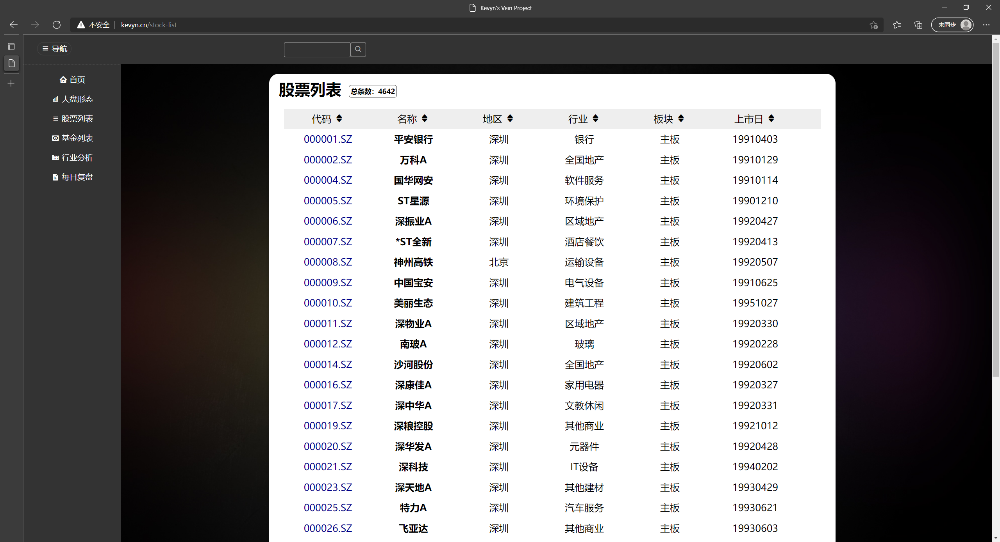

# Vein Project: Renderer

This project is the data presentation part of the **vein project**,

## The Vein Project

This project aim at creating an application to provide gamut of analysis features for Chinese stock market.

- Python based data analysis and API services: [vp-data](https://github.com/vein-project-team/vp-data)
- Typescript + Vue3 data presentation: [vp-renderer](https://github.com/vein-project-team/vp-renderer)

Current features:

- data collecting: collect data from specific data source
- data warehousing: sort and store data in local database for analysis
- easily create new tables and fetch new data within the framework
- automatic data update
- data analysis framework
- data presentation in modern webapp (early stage)

## Screenshots

**Attention**: The project is now being refactored, some functionalities might be unavailable for a period.

### home page

### index k-line

### Stock list

### Stock list search

### Stock detail

